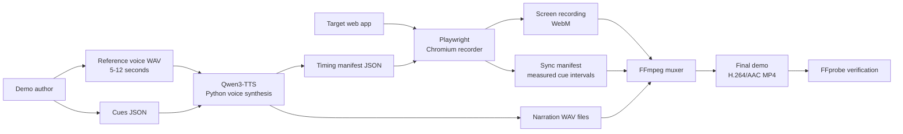

# auto-demo

Turn a product workflow into a narrated demo video. Point it at a web app, give it a list of sentences and a 10-second recording of your own voice, and it produces a synchronized 1080p MP4 with a synthetic cursor and narration in your voice.

Everything runs locally. No API keys, no hosted recording service.

## What you need

Install these once, if you don't have them:

```bash
brew install python@3.12 node ffmpeg
```

On macOS, put the 3.12 ahead of any other Python on your `PATH` before you go any further — see the note in [Install](#install).

| Tool | Version | Notes |
| --- | --- | --- |
| Python | 3.11 or 3.12 | Use 3.12. Do not use 3.13+ — the PyTorch wheels aren't published for it yet. |
| Node.js | 20 or newer | `node -v` should print `v20` or higher. |
| FFmpeg | any recent | Provides `ffmpeg` and `ffprobe`. |

Budget about **3 GB of free disk space** — the first run downloads the Qwen3-TTS 0.6B model and keeps it cached.

On an Apple Silicon Mac the pipeline uses MLX and is fast. On Windows and Linux it uses PyTorch, which falls back to CPU if you have no NVIDIA GPU, and is slow there.

## Install

```bash
git clone https://github.com/joshshiman/auto-demo.git
cd auto-demo
bash scripts/setup_env.sh
npx playwright install chromium
```

`setup_env.sh` creates a virtual environment (`.venv-mlx` on Apple Silicon, `.venv` elsewhere), installs the Python packages, and installs the Node packages. It takes a couple of minutes.

**macOS only**, if `python3 --version` isn't already 3.11 or 3.12:

```bash
brew install python@3.12
echo 'export PATH="/opt/homebrew/opt/python@3.12/bin:$PATH"' >> ~/.zshrc
source ~/.zshrc
```

`setup_env.sh` calls whatever `python3` is on your `PATH`, so do this **before** running it.

Confirm it worked:

```bash
python3 --version              # must be 3.11.x or 3.12.x
./.venv/bin/python --version   # or ./.venv-mlx/bin/python --version
```

## Make a demo

Six steps. Steps 1–4 are the same for every demo, so once you have a voice sample you can skip ahead to the parts you change.

### 1. Write your narration

Create `output/cues.json`. One object per sentence, in the order the sentences should be spoken:

```json
[
  { "id": "cue_01", "text": "Welcome to the reporting dashboard." },
  { "id": "cue_02", "text": "Here is the workflow you can automate." }
]
```

Keep the sentences short. Long ones produce long, dead-looking clips.

### 2. Record your voice sample

Record 5–12 seconds of yourself speaking normally — no music, no background noise — and save it as `assets/reference_voice.wav`.

If you recorded something else first, convert and trim it:

```bash
ffmpeg -i ~/Desktop/my_voice.m4a -t 8 -ar 16000 -ac 1 assets/reference_voice.wav
```

This file is deliberately ignored by Git. It is your voice, and it should never end up in a public repo.

On Apple Silicon you're done. On Windows and Linux, also write down the **exact words** you said in that clip — the PyTorch backend needs them verbatim.

### 3. Generate the narration

```bash
if [[ "$(uname -s)" == "Darwin" && "$(uname -m)" == "arm64" ]]; then
  PY=./.venv-mlx/bin/python
else
  PY=./.venv/bin/python
fi

$PY scripts/voice_clone.py \
  --cues output/cues.json \
  --ref-audio assets/reference_voice.wav \
  --ref-transcript "the exact words you spoke in the sample"
```

`--ref-transcript` is only read by the PyTorch backend, so you can leave it off on a Mac. The first run downloads the model and takes a few minutes; later runs take seconds.

You should now have `output/audio/cue_01.wav`, `cue_02.wav`, and a timing manifest.

### 4. Describe the workflow

The recorder is a template — you have to tell it what to click.

```bash
cp scripts/run_demo_template.js output/run_demo.js
```

Open `output/run_demo.js` and replace the body of `runProductWorkflow` with your product's steps. Use `runCue` so narration starts only once the matching screen is on-screen:

```js
async function runProductWorkflow(page, timings, cursor) {
  await page.goto(process.env.DEMO_URL);

  await runCue(page, timings, 'cue_01', {scene: {role: 'heading', name: /Dashboard/}});

  await cursor.click(page.getByRole('tab', {name: 'Analytics'}));
  await runCue(page, timings, 'cue_02', {scene: {role: 'tab', name: 'Analytics'}});
}
```

Two rules that matter:

- **`runCue` order must match `cues.json` order.** The muxer lines up the audio with the recording by position.
- **Always give `runCue` a `scene`.** Without it, narration starts over a loading screen.

The template lives in `output/`, so run it from the repo root — it resolves `output/` relative to itself.

### 5. Record

Start your app, then:

```bash
export DEMO_URL="http://localhost:3000"
node output/run_demo.js
```

A browser window opens and drives itself. You should end up with `output/recordings/*.webm` and `output/sync_manifest.json`, which records when each cue actually started and ended.

Set `DEMO_HEADLESS=1` to record without a visible window.

### 6. Mux and check

```bash
bash scripts/mux.sh output/audio output/recordings output/final_demo.mp4
```

Then confirm you got a real video — you want H.264 video, AAC audio, and 1920x1080:

```bash
ffprobe -v error -show_entries format=duration:stream=codec_name,width,height \
  -of default=noprint_wrappers=1 output/final_demo.mp4
```

`output/final_demo.mp4` is your demo. If the duration looks wrong, see [Troubleshooting](#troubleshooting).

## Optional: install as a Claude Code skill

If you use Claude Code, install the repo as a personal skill and it will drive this whole pipeline for you:

```bash
mkdir -p ~/.claude/skills
git clone https://github.com/joshshiman/auto-demo.git ~/.claude/skills/record-demo
bash ~/.claude/skills/record-demo/scripts/setup_env.sh
(cd ~/.claude/skills/record-demo && npx playwright install chromium)
```

Start Claude Code inside your *target app's* repo and run `/record-demo`. `SKILL.md` is the entry point. To update later:

```bash
(cd ~/.claude/skills/record-demo && git pull)
```

## Environment variables

| Variable | Default | Used by | What it does |
| --- | --- | --- | --- |
| `DEMO_URL` | — (required) | recorder | The app to record. |
| `DEMO_HEADLESS` | `0` | recorder | Set to `1` to hide the browser window. |
| `DEMO_VIEWPORT_WIDTH` | `2000` | recorder | Page width. Override for very wide layouts. |
| `DEMO_VIEWPORT_HEIGHT` | `1125` | recorder | Page height. |
| `DEMO_ACTIONS` | — | recorder | JSON array of clicks (`{selector, cue, waitForBefore, waitForAfter}`) if you'd rather not edit the template. |
| `DEMO_INITIAL_SCENE` | — | recorder | JSON scene descriptor used when `DEMO_ACTIONS` is empty. |
| `SYNC_MANIFEST` | `output/sync_manifest.json` | muxer | Override the sync manifest path. |

The page is recorded at 2000x1125 so wide layouts don't clip at the right edge, then scaled down to 1920x1080 in the final file.

## How it fits together



The interesting part is the round trip. Narration is generated *before* recording, so the recorder knows how long each clip should be. The recorder then writes down when each clip actually played, and the muxer uses that to insert silence over browser transitions — otherwise your next sentence starts while the next screen is still loading.

## Project layout

| Path | Purpose |
| --- | --- |
| `scripts/setup_env.sh` | Creates the Python environment and installs Node dependencies |
| `scripts/voice_clone.py` | Generates narration audio and timing manifests with Qwen3-TTS |
| `scripts/run_demo_template.js` | Recorder template with synthetic cursor, click effects, and cue timing |
| `scripts/mux.sh` | Aligns narration with the recording and muxes the final MP4 |
| `output/` | Everything generated. Ignored by Git. |
| `assets/reference_voice.wav` | Your voice sample. Ignored by Git. |

## Troubleshooting

**`externally-managed-environment`** — you installed into system Python. Use `scripts/setup_env.sh`; it makes its own venv.

**`ref_text is required`** — you used the PyTorch backend without `--ref-transcript`, or you passed the wrong words. The transcript must match the sample exactly.

**Torch import errors / `backcompat`** — your Python is too new. Install 3.12 and rerun `scripts/setup_env.sh` after deleting the venv.

**Narration takes forever** — you're on the CPU PyTorch path. On a Mac, make sure the MLX venv is the one you picked in step 3.

**`No recordings found`** — the recorder didn't finish, or you muxed from the wrong directory. Check that `output/recordings/*.webm` exists.

**Final video is shorter than you expected** — the muxer caps the output at the narration length, and stops early if the recording runs out first. A small trailing cut is normal. A large mismatch means a cue is missing from `cues.json`, or `runCue` order doesn't match it. Compare the two:

```bash
ffprobe -v error -show_entries format=duration \
  -of default=noprint_wrappers=1 output/audio/master_narration.wav
ffprobe -v error -show_entries format=duration \
  -of default=noprint_wrappers=1 output/final_demo.mp4
```

**Model download fails** — check free disk space, clear an old `~/.cache/huggingface`, retry.

## Development checks

```bash
npm ci
npm run lint
npm run typecheck
npm test
```

These validate the recorder template's syntax only. There is no end-to-end test target in the repo.

## Before you publish anything

- Keep `assets/*.wav` local. Never commit a personal voice reference.
- Keep `.env`, credentials, authenticated URLs, and target-specific secrets out of the repo.
- Keep `output/` ignored — it contains recordings, selectors, and application data.
- No license is included. Add one before you distribute this outside your team.
