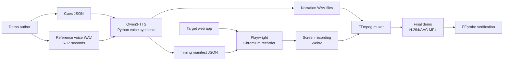

# auto-demo

A local-first pipeline for turning a product workflow into a narrated demo video. It combines Qwen3-TTS voice cloning, Playwright browser recording, and FFmpeg to produce a synchronized H.264/AAC MP4.

[](https://github.com/joshshiman/auto-demo/stargazers)
[](https://github.com/joshshiman/auto-demo/network/members)
[](https://github.com/joshshiman/auto-demo/issues)
[](https://nodejs.org/)
[](https://www.python.org/)
[](https://playwright.dev/)
[](https://ffmpeg.org/)

## Architecture



The pipeline is designed to run locally against a target web application. It does not provide an application server, database, or hosted recording service; the target app can run locally or be accessed at a URL.

## Requirements

- Python 3.11 or newer with `venv` support
- Node.js 20 or newer and npm
- FFmpeg and FFprobe in `PATH`
- Approximately 3 GB of free disk space for the default Qwen3-TTS 0.6B model
- A clean 5–12 second WAV reference recording

The PyTorch backend requires the exact transcript of the reference recording. Apple Silicon uses the MLX backend when available; other platforms use PyTorch with CUDA, MPS, or CPU fallback.

## Quick start

Clone the repository and install the local dependencies:

```bash
git clone https://github.com/joshshiman/auto-demo.git
cd auto-demo
bash scripts/setup_env.sh
npx playwright install chromium
```

The setup script creates `.venv-mlx` on Apple Silicon and `.venv` elsewhere, installs the selected Python backend, and installs the Node dependencies.

Create the local output directory and cue file at `output/cues.json`:

```json
[
  {
    "id": "cue_01",
    "text": "Welcome to the product dashboard."
  },
  {
    "id": "cue_02",
    "text": "Here is the workflow you can automate."
  }
]
```

Provide your own reference voice at `assets/reference_voice.wav`. Voice recordings are intentionally ignored by Git because they are personal biometric data and should not be published accidentally. The MLX path uses the reference audio directly; the PyTorch path also needs its transcript:

```bash
if [[ "$(uname -s)" == "Darwin" && "$(uname -m)" == "arm64" ]]; then
  PYTHON=.venv-mlx/bin/python
  BACKEND_ARGS=(--backend mlx)
else
  PYTHON=.venv/bin/python
  BACKEND_ARGS=(--backend pytorch)
fi

"$PYTHON" scripts/voice_clone.py \
  --cues output/cues.json \
  --ref-audio assets/reference_voice.wav \
  --ref-transcript "the exact words spoken in the reference" \
  --model-size 0.6B \
  "${BACKEND_ARGS[@]}"
```

The MLX backend does not use `--ref-transcript`; omit that argument for the MLX command.

Copy the recorder template and customize `runProductWorkflow` for the target product:

```bash
mkdir -p output
cp scripts/run_demo_template.js output/run_demo.js
```

Set the target URL, start the target application, and run the recorder:

```bash
export DEMO_URL="http://localhost:3000"
node output/run_demo.js
```

Mux the generated narration and recording, then verify the result:

```bash
bash scripts/mux.sh output/audio output/recordings output/final_demo.mp4

test -s output/final_demo.mp4
ffprobe -v error -show_entries format=duration:stream=codec_name,width,height \
  -of default=noprint_wrappers=1 output/final_demo.mp4
```

Generated audio, video, timing manifests, and recordings are written under `output/` and are not intended to be committed.

## Project layout

| Path | Purpose |
| --- | --- |
| `scripts/setup_env.sh` | Creates the backend-specific Python environment and installs Node dependencies |
| `scripts/voice_clone.py` | Generates narration audio and timing manifests with Qwen3-TTS |
| `scripts/run_demo_template.js` | Playwright recorder template with cursor, click effects, and configurable target workflow |
| `scripts/mux.sh` | Concatenates narration and muxes it with the selected WebM recording |
| `output/` | Local generated artifacts; ignored by Git |
| `assets/reference_voice.wav` | Local reference voice input; ignored by Git |

## Development checks

Install Node dependencies with `npm ci`, then run the available checks:

```bash
npm run lint
npm run typecheck
npm test
```

The JavaScript checks currently validate the recorder template syntax. The recorder requires a customized workflow and a running target application; the repository does not include an end-to-end test target.

## Publishing checklist

Before publishing, review the repository for data that should remain private:

- Keep `assets/*.wav` local. Do not commit a personal voice reference.
- Keep `.env`, `.env.*`, credentials, authenticated URLs, and target-specific secrets out of the repository.
- Keep `output/` ignored; it can contain recordings, narration, selectors, and application data.
- Keep model caches, virtual environments, Playwright reports, and coverage files local.
- Add an appropriate `LICENSE` file if you want to grant public reuse rights. No license is currently included.

## License

No license has been selected. Add a license file before distributing or accepting contributions.
